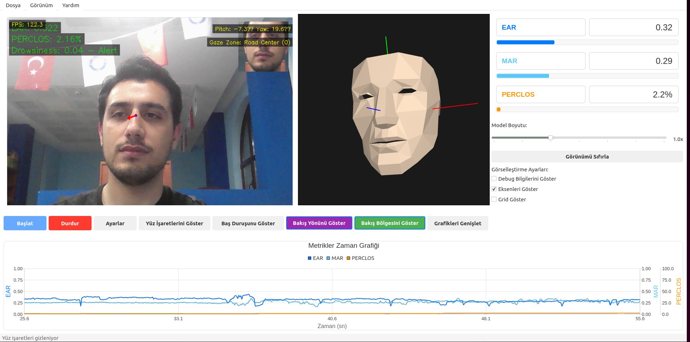
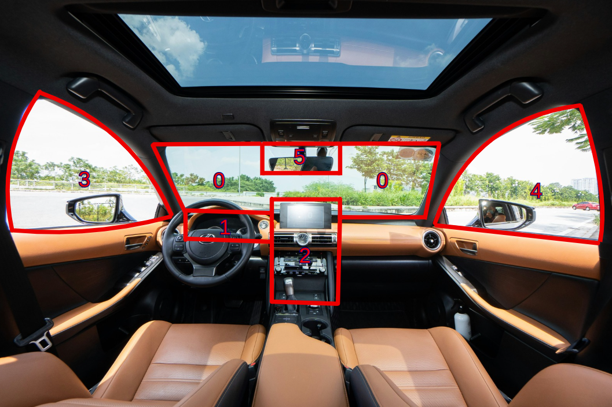
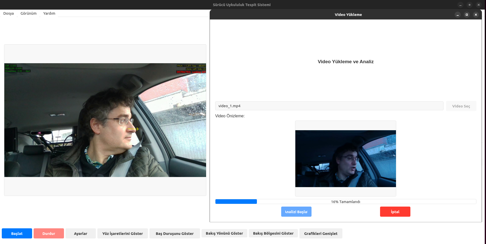

# 🚗 Driver Drowsiness Detection System
## Sürücü Uykululuk Tespit Sistemi

[](https://python.org)
[](https://riverbankcomputing.com/software/pyqt/)
[](https://mediapipe.dev/)
[](LICENSE)






---

## 🚀 Kurulum

### 🔧 1. Gerekli Paketleri Yükleme

```bash
# Repository'yi klonlayın
git clone https://github.com/kullanici-adi/driver-drowsiness.git
cd driver-drowsiness

# Sanal ortam oluşturun (önerilen)
python -m venv venv

# Sanal ortamı etkinleştirin
# Windows:
venv\Scripts\activate
# macOS/Linux:
source venv/bin/activate

# Gerekli paketleri yükleyin
pip install -r requirements.txt
```

### 🤖 2. ETH-XGaze Modelini İndirme

ETH-XGaze modeli büyük boyutta olduğu için repository'de bulunmaz. Aşağıdaki adımları izleyin:

#### **Seçenek A: Resmi Model (Önerilen)**
1. [ETH-XGaze resmi sayfasını](https://ait.ethz.ch/projects/2020/ETH-XGaze/) ziyaret edin
2. Model dosyasını indirin (`epoch_24_ckpt.pth.tar`)
3. `models/` klasörüne yerleştirin:
   ```bash
   mkdir -p models
   # İndirilen dosyayi models klasörüne kopyalayın
   cp /indirme/yolu/epoch_24_ckpt.pth.tar models/eth_xgaze_model.pth
   ```

#### **Seçenek B: ONNX Formatı (Hızlı Çıkarım)**
```bash
# Model dönüştürme betiğini çalıştırın
python scripts/convert_ethxgaze_model.py models/eth_xgaze_model.pth models/eth_xgaze_model.onnx --export_onnx
```

---

## 💻 Kullanım

### 🎮 1. Temel Kullanım

```bash
# Ana uygulamayı başlatın
python run.py
```

**Kullanım Adımları:**
1. 🎥 Kameranızın bağlı olduğundan emin olun
2. ▶️ **"Başlat"** düğmesine tıklayın
3. 👤 Yüzünüzü kamera görüş alanında tutun
4. 📊 Gerçek zamanlı metrikleri izleyin
5. ⏹️ **"Durdur"** ile analizi sonlandırın


### 📹 2. Video Analizi

```bash
# Video dosyası analizi
python examples/analyze_video.py --input video.mp4 --output results/

# Toplu video analizi
python scripts/batch_analyze.py --input_dir videos/ --output_dir results/
```

### 🎯 3. Gaze Zone Tespiti

```bash
# Bakış bölgesi testi
python tests/test_gaze_zone_detector.py --camera 0 --show_zones

# Gaze zone kalibrasyonu
python scripts/calibrate_gaze_zones.py
```


---

## 📊 Bilimsel Metrikler

### 👁️ **EAR (Eye Aspect Ratio)**
- **Formül**: `EAR = (|p2-p6| + |p3-p5|) / (2 * |p1-p4|)`
- **Eşik Değeri**: 0.21 (altında göz kapalı)
- **Kullanım**: Anlık göz kırpma ve kapalılık tespiti

### 👄 **MAR (Mouth Aspect Ratio)**
- **Formül**: `MAR = |p14-p18| / |p12-p16|`
- **Eşik Değeri**: 0.65 (üstünde ağız açık)
- **Kullanım**: Esneme tespiti

### 💤 **PERCLOS**
- **Tanım**: 60 saniyelik periyotta göz kapanma yüzdesi
- **Uyarı Eşiği**: %15
- **Kritik Eşik**: %20

### 😴 **KSS (Karolinska Sleepiness Scale)**
| Puan | Durum | Açıklama |
|------|-------|----------|
| 1-3 | 🟢 Normal | Tam uyanık durumda |
| 4-5 | 🟡 Hafif | Hafif yorgunluk belirtileri |
| 6-7 | 🟠 Uyarı | Dikkat dağınıklığı başlangıcı |
| 8-9 | 🔴 Kritik | Acil müdahale gerekli |

[🎯 **GÖRSEL YERİ:** Metriklerin görsel karşılaştırması - bar chart veya dashboard görünümü]

---

## 🔬 Gelişmiş Özellikler

### 🎭 **3D Head Pose Visualization**
- **Real-time 3D Model**: Anlık baş duruşu görselleştirmesi
- **Pitch/Yaw/Roll**: Üç eksen rotasyon takibi
- **Interactive Controls**: Kullanıcı kontrollü görünüm ayarları

```python
# 3D model kullanım örneği
from src.ui.head_pose_model import Head3DPanel

head_panel = Head3DPanel()
head_panel.update_pose(pitch=10, yaw=-5, roll=2)
```

### 📍 **Gaze Zone Detection**
AB regülasyonu C(2023)4523 uyumlu 9 bölge:

| Zone ID | Bölge Adı | Alan | Kritiklik |
|---------|-----------|------|-----------|
| 0 | Road Center | Alan 2 | 🔴 Kritik |
| 1 | Driving Instruments | Alan 2 | 🟡 Sürüş İlgili |
| 2 | Infotainment | Alan 1 | 🟠 Sürüş Dışı |
| 3 | Left Side | Alan 2 | 🟡 Sürüş İlgili |
| 4 | Right Side | Alan 2 | 🟡 Sürüş İlgili |
| 5 | Rear Mirror | Alan 2 | 🔴 Kritik |

### 📈 **İstatistiksel Analiz**
```python
# Gaze istatistikleri
from src.detection.gaze_statistics import get_gaze_statistics_recorder

recorder = get_gaze_statistics_recorder()
stats = recorder.get_statistics()
```

[🎯 **GÖRSEL YERİ:** Gaze zone detection'ın çalışır haldeki ekran görüntüsü]

---

## 🧪 Test ve Değerlendirme

### 🔬 **Bilimsel Değerlendirme**
```bash
# Precision/Recall analizi
python scripts/scientific_evaluation.py \
  --ground_truth data/gt.json \
  --predictions data/pred.json \
  --output_dir evaluation_results/
```

[🎯 **GÖRSEL YERİ:** Test sonuçlarını gösteren grafik - accuracy, precision, recall comparisons]

---

## 🔬 **Bilimsel Kaynaklar**
- **ETH-XGaze**: Gaze estimation model ([Paper](https://arxiv.org/abs/2007.15837))
- **MediaPipe**: Face mesh detection ([Documentation](https://google.github.io/mediapipe/))

---
